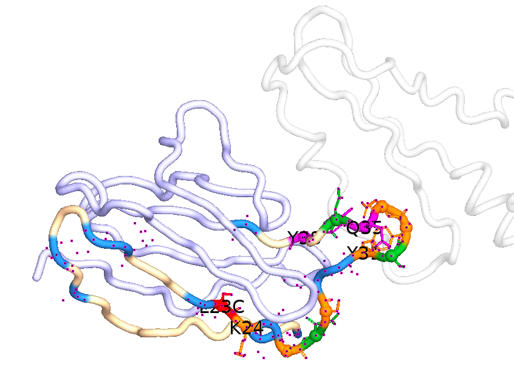
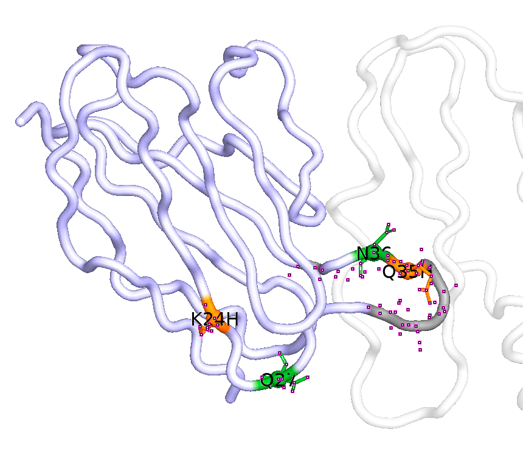
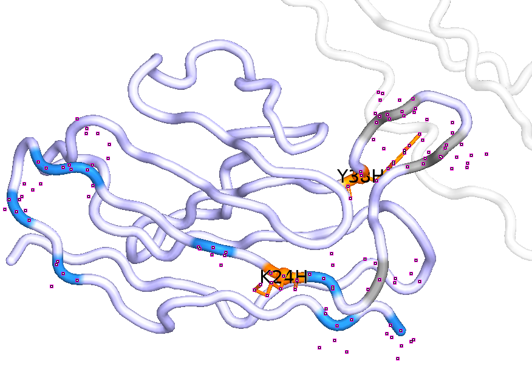
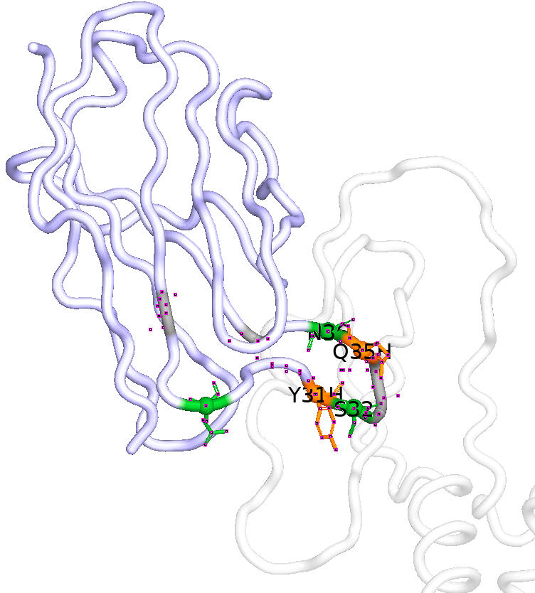
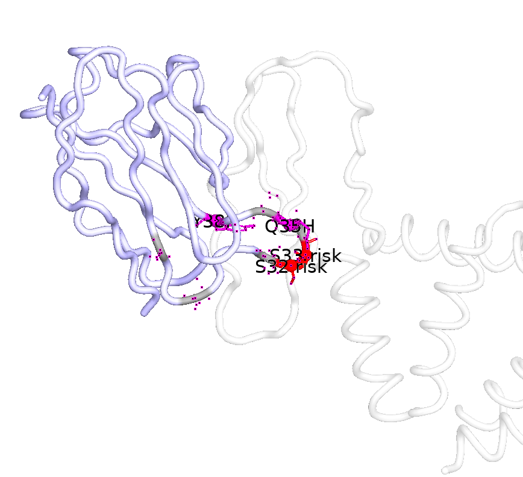
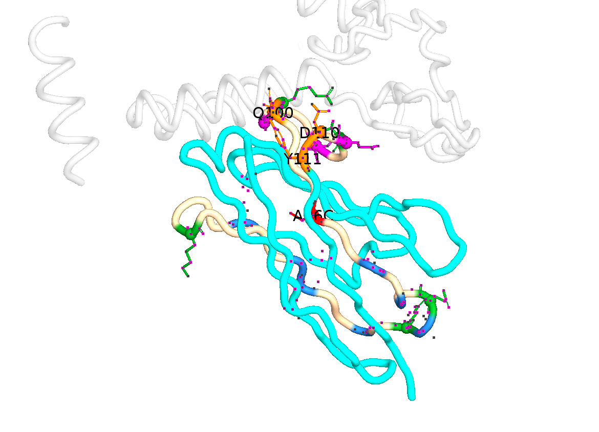
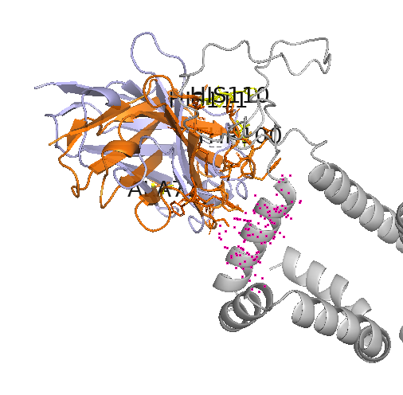

# HBsAg pH-sensitive antibody 初始设计：位点选择、变体设计与结果对应关系

## 1. 设计窗口与位点选择逻辑

两个 40 aa 窗口展开：**1E62 使用 light chain VL:1–40**，**sdAb 使用 VHH:72–111**。

His seed 的选择主要基于方向。

第一类是 **CDR/interface 直接调控**。

第二类是 **CDR 构象调控**。这类位点不一定直接接触抗原，但位于 CDR 根部、CDR-adjacent framework 或 loop 支撑区域。

**rescue 位点**。His seed 可能带来 pH 响应，也可能削弱中性条件下的结合或局部结构稳定性。

---

## 2. 1E62：VL:1–40 位点设计

1E62 的 VL:1–40 覆盖 CDR1-L 和相邻 framework。
界面位点包括：
```text
K24, S26, S28, Y31, S33, D34
```
CDR1 构象位点：

```text
Q35, Y38
```



---

## 3. 1E62：结果与设计思路的对应

1E62 最终候选池形成了几个集中的 **His seed + rescue** 模块。频率在这里作为结果分布，用于说明不同设计模块在候选池中的保留情况。

<p>
  
  
</p>
<p>
  
  
</p>

### 3.1 K24H + Q35H
```text
His seed: K24H + Q35H
rescue: Q27G/S/T, N36A/S/T/D, A40D/T, S14/E17/R18
约 21.7%
```

### 3.2 K24H + Y38H

```text
His seed: K24H + Y38H
rescue: V3E/M/L, A12I, T22D/E, S25D/F/G, Q27
约 20.2%
```


### 3.3 Y31H + Q35H

```text
His seed: Y31H + Q35H
典型 rescue: N36A/S/T/D, Q27, S32, S14/R18
结果占比: 约 17.7%
```

Y31H 位于 CDR1 内，Q35H 位于 CDR1 边界附近。

### 3.4 K24H + Y31H

```text
His seed: K24H + Y31H
典型 rescue: N36A/S/T, Q27, S32, S14/R18
约 13.9%
```

该模块中的两个 His seed 都位于 CDR1 相关区域，因此 rescue 的重点是避免 CDR1 直接调控区过度扰动。

### 3.5 Q35H + Y38H

```text
His seed: Q35H + Y38H
典型 rescue: S32E, Q27/N36, S14, L30/T22
约 5.5%
```

Q35H 和 Y38H 都位于 CDR1 边界或支撑框架区域

---

## 4. sdAb：VHH:72–111 位点设计

sdAb 的 VHH:72–111 覆盖 FR3 支撑区和 CDR3。

sdAb 的 CDR3 His seed 包括：

```text
Q100, G102, V105, E108, D110, Y111
```

sdAb 的主要 rescue 位点包括：

```text
K76, R87, E89, R101, V107
```

A96C 被 hard-protect，用于保留亲本 Cys/结构约束。



---

## 5. sdAb：结果与设计思路的对应

sdAb 最终候选池主要由 Q100H、D110H、Y111H 三类单 His seed，以及 Q100H+D110H、D110H+Y111H 两类双 His seed 构成。

### 5.1 Q100H

```text
His seed: Q100H
rescue: E89A/D/F/S, V107A/D/T/Y, K76A/D/E/Q, V105A/D, D110G/F/E/A
约 30.0%
```
### 5.2 D110H

```text
His seed: D110H
rescue: R101A/D/Q/M, R87E/D/T/Q, K76A/D/E/Q, A88P/D/E, S85
约 29.9%
```

### 5.3 Y111H

```text
His seed: Y111H
rescue: E89A/D, R87E/D/Q, K76A/D, Q82D/E, L81A/D, Q100E
约 29.1%
```

Y111H 位于 CDR3 末端，rescue 主要集中在 FR3-CDR3 根部和 CDR3 support 位点。

### 5.4 Q100H + D110H

```text
His seed: Q100H + D110H
rescue: T91S/V/E/N/P, S85N/I/P/Q, R87T/K
约 7.2%
```

该双 His 组合扰动更强，rescue 主要集中在 T91、S85、R87。

### 5.5 D110H + Y111H

```text
His seed: D110H + Y111H
rescue: E89D/A/T/S, R87, Q82, S85, R101
约 3.7%
```

D110H 和 Y111H 都靠近 CDR3 末端，局部风险较高，因此占比较低。

---

## 6. AF3 结构验证结果

1E62 的 AF3 结果整体较好。

sdAb 的 结构预测结果显示接触位点与野生型相比不一致

