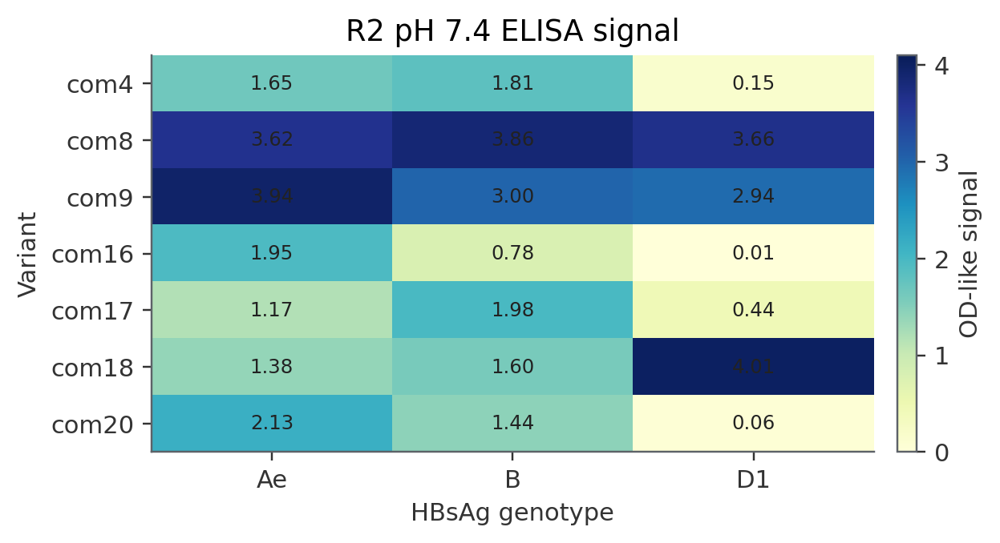
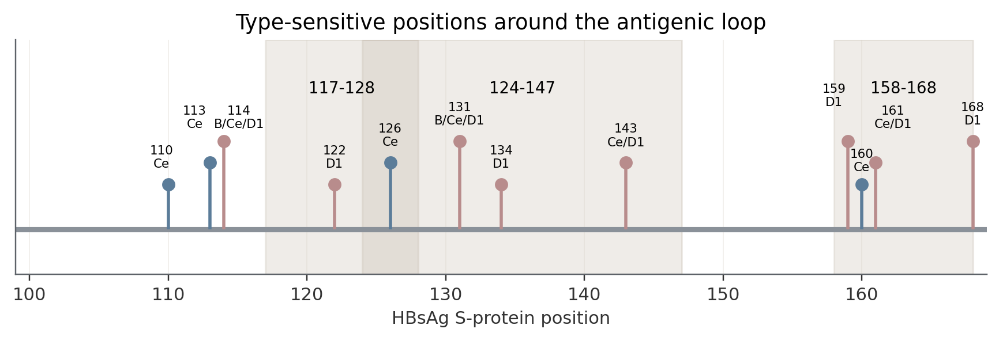
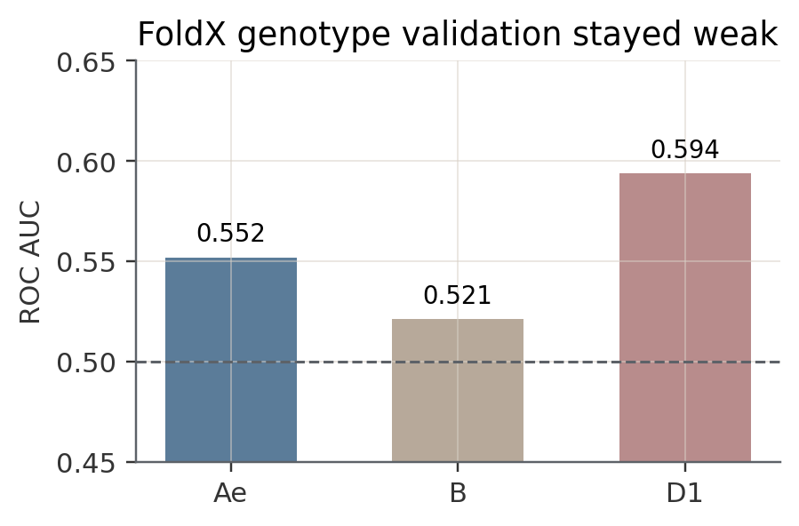
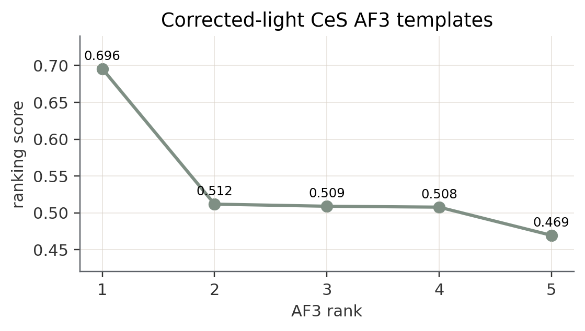
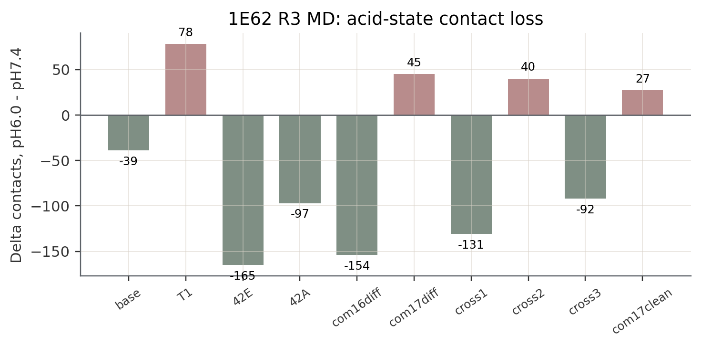
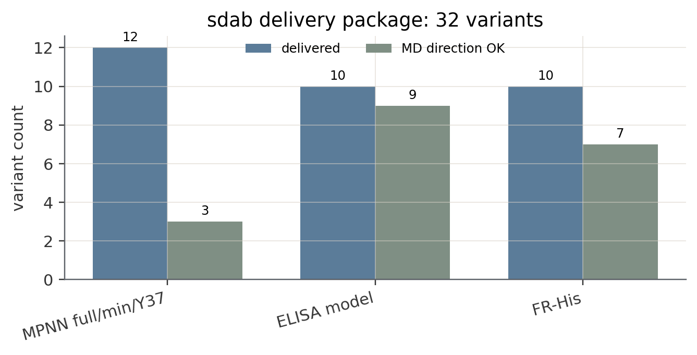

# 近期任务实验报告整理

日期：2026-05-07
项目：`optim-pipe`，pH 依赖抗体结合优化
用途：实验室笔记手写版素材。正文尽量短，图和表格可直接照抄或打印贴入。

## 一页总览

| 任务 | 做了什么 | 最主要结果 | 下一步 |
| --- | --- | --- | --- |
| HBsAg 型别泛化机制 | 用 R2 ELISA、抗原序列差异和 AF3 距离扫描解释 Ae/B/Ce/D1 表型差异 | L-only 的 com8/com9/com18 跨型别强；H-only 的 com16/com20 在 D1 明显弱 | 用 corrected-light CeS 模板补做 CeS 接触扫描 |
| FoldX 多型别验证 | 用 Ae/B/D1 多模板检查 FoldX 能否预测型别差异 | Ae/B/D1 AUC 只有 0.552/0.521/0.594，不能作为主筛选器 | FoldX 只保留为负结果和辅助边界 |
| CeS AF3 WT 模板 | 修正 light chain 111 aa 错误，重跑 AF3 得到 5 个 CeS WT 结构 | 5 个 rank 均通过序列核对；rank1 score = 0.696 | 进入 CeS 接触扫描 |
| 1E62 R3 设计 | 在 com18 L 链 His 簇背景下测试 H 链位点组合 | 42E、cross1、com16diff 的 pH6 接触减少明显；com17 相关全套组合不稳 | 等 R3 湿实验回看 |
| sdab 32 变体 | 三条路线交付 32 个候选：MPNN、ELISA 模型、FR-His | ELISA 模型和 FR-His 方向较好；A4/A1/r4_04/r4_01 是重点 | 等 42 变体湿实验结果 |
| DeepScientist wet-lab blind 包 | 准备只含湿实验数据的启动包 | 任务记录显示已打包，未启动 quest | 启动前再确认包路径和内容 |

---

## 报告 1：HBsAg 型别泛化结合机制

**目的**
解释 1E62 R2 变体为什么在不同 HBsAg 型别上表现不同。重点不是继续优化 FoldX，而是找出哪些抗体突变更可能跨型别保留结合。

**材料和数据**

- R2 逐型别 ELISA：`experiments/1E62/R2/wet_lab/elisa_summary.csv`
- 整理表：`.tasks/active/hbsag-genotype-generalization/artifacts/r2_per_type_phenotype_table.csv`
- 抗原序列差异：`experiments/1E62/data/antigen_genotypes.fasta`
- AF3 模板：AeS、BaS、D1S 已有；CeS corrected-light 模板已补齐

**方法简述**

1. 按 pH7.4 ELISA 信号把变体粗分为 strong / mid / low。
2. 把 HBsAg AeS、BaS、CeS、D1S 的差异位点标到 117-147 和 158-168 区域。
3. 用 AF3 模板测抗体突变位点到抗原差异位点的最近距离。
4. 重点比较两类变体：L-only 广谱强结合组和 H-only D1 风险组。

**关键表 1：R2 pH7.4 逐型别表型**

| 变体 | 类型 | Ae | B | D1 | 简要判断 |
| --- | --- | ---: | ---: | ---: | --- |
| com8 | L-only | 3.62 | 3.86 | 3.66 | 三型都强 |
| com9 | L-only | 3.94 | 3.00 | 2.94 | 三型都强 |
| com18 | L-only | 1.38 | 1.60 | 4.01 | 三型都强，D1 更强 |
| com16 | H-only | 1.95 | 0.78 | 0.01 | D1 失败 |
| com20 | H-only | 2.13 | 1.44 | 0.06 | D1 失败 |
| com4 | H-only | 1.65 | 1.81 | 0.15 | D1 只剩中等 |
| com17 | H-only | 1.17 | 1.98 | 0.44 | D1 只剩中等 |

**结果 1：抗原差异集中在几段关键环区**

**关键表 2：重点型别差异位点**

| 区间 | 代表位点 | 主要差异 | 笔记写法 |
| --- | --- | --- | --- |
| 117-128 | 122、126 | D1 在 122；Ce 在 126 | 第一圈附近，最靠近抗体突变脚印 |
| 124-147 | 131、134、143 | Ba/Ce/D1 在 131；D1 在 134；Ce/D1 在 143 | 抗原性环核心区 |
| 158-168 | 159、160、161、168 | D1 和 Ce 都有差异 | 当前距离较远，可能是间接影响 |

**结果 2：FoldX 多型别验证没有通过**

| 方法 | Ae AUC | B AUC | D1 AUC | 结论 |
| --- | ---: | ---: | ---: | --- |
| FoldX BuildModel Dif energy | 0.552 | 0.521 | 0.594 | 方向很弱，不显著 |

这个结果说明：FoldX 不是运行失败，而是“评分假设没有验证成功”。后续不能把它作为跨型别主判断，只能作为弱辅助。

**当前机制结论**

- L-only 广谱强组主要贴近 122 附近，不是完全避开型别差异，而是更能容忍这段变化。
- H-only D1 风险组的脚印主要在 123-126 附近，可能让结合姿态对第一圈形状更挑剔。
- 159-168 虽然有 D1/Ce 差异，但当前结构里离 R2 抗体突变较远，暂不优先解释为直接接触。

---

## 报告 2：CeS corrected-light AF3 WT 模板

**目的**
为 HBsAg CeS 补齐结构模板，用于后续 CeS 接触扫描。第一批 CeS AF3 结构的 light chain 只有 111 aa，缺少 `SG`，不能作为正式模板。

**方法简述**

1. 使用项目 WT heavy、WT light 和 CeS antigen FASTA。
2. 随机 5 个 model seeds，每个 seed 生成 1 个结构。
3. 将输出整理为项目链约定：A = heavy，B = light，C = CeS antigen。
4. 对 5 个 rank 全部做序列核对。

**关键表：AF3 CeS ranked 结果**

| Rank | Seed | Score | 序列核对 |
| ---: | ---: | ---: | --- |
| 1 | 495296019 | 0.696 | H=115, L=113, CeS=226，OK |
| 2 | 635954951 | 0.512 | OK |
| 3 | 1129861070 | 0.509 | OK |
| 4 | 75801088 | 0.508 | OK |
| 5 | 2026110668 | 0.469 | OK |

**置信度摘录**

| 指标 | 数值 |
| --- | ---: |
| pTM | 0.56 |
| ipTM | 0.66 |
| chain pair ipTM H-A | 0.63 |
| chain pair ipTM L-A | 0.86 |
| light chain context | `FSGSGSGTDF` |

**结论**
CeS 的正式 WT 结构模板已经补齐。旧的 wrong-light 目录只保留历史记录，后续结构层面分析应使用 corrected-light rank1-rank5。

---

## 报告 3：1E62 R3 设计和 MD 验证

**目的**
R3 固定 com18 的 L 链 His 簇，在 H 链上组合 com16/com17 的差异位点。目标是找到能保留 pH7.4 结合、同时在酸性下降低界面接触的组合。

**设计逻辑**

- R3-base：com18 作为基线。
- T1：加入 com16/com17 共享的 4 个 H 链突变。
- 42E / 42A：单独测试 H42 位点。
- com16diff / com17diff：分别加入 com16 或 com17 的完整差异。
- cross1 / cross2 / cross3：交叉组合 H23 和 H42。
- com17clean：补全 com17 剩余差异。

**关键表：R3 MD 结果**

| 变体 | RMSD@7.4 | ΔContacts | 判断 |
| --- | ---: | ---: | --- |
| R3-base | 1.3 | -39 | 酸性接触减少，幅度小 |
| R3-T1 | 10.9 | +78 | pH7.4 不稳 |
| R3-T1-42E | 1.9 | -165 | 重点候选 |
| R3-T1-42A | 1.7 | -97 | 可测 |
| R3-T1-com16diff | 3.9 | -154 | 响应强，但 pH7.4 偏弱 |
| R3-T1-com17diff | 23.3 | +45 | pH7.4 不稳 |
| R3-T1-cross1 | 1.6 | -131 | 重点候选 |
| R3-T1-cross2 | 1.9 | +40 | pH 响应消失 |
| R3-T1-cross3 | 1.3 | -92 | 酸性结构过度变化 |
| R3-com17clean | 8.3 | +27 | 不稳 |

**结论**
R3-T1-42E 和 R3-T1-cross1 最值得关注。com17 相关完整组合在 MD 中稳定性差，可能在实验中表达或结合风险更高。

---

## 报告 4：sdab 32 变体交付

**目的**
为 sdab 单域抗体设计一批 pH 响应候选。总共 32 个变体，分成三条路线。

**关键表：三条路线**

| 路线 | 数量 | 思路 | 当前读法 |
| --- | ---: | --- | --- |
| MPNN 全设计/精简/Y37 | 12 | 固定 His seed，用 ProteinMPNN 重设计全序列，再做精简和 F37Y 对照 | 3/5 全设计 MD 方向正确，精简版降低表达风险 |
| ELISA 模型驱动 | 10 | 用已有 ELISA 数据训练 ElasticNet，再筛 His 组合 | 多数候选接触减少，r4_04/r4_01 排名最高 |
| FR-His 新机制 | 10 | 把 His 放到 FR3，用远端扰动影响 CDR 几何 | 7/10 方向正确，A4/A1/A3/A2 值得优先看 |

**候选摘录**

| 候选 | 来源 | 关键指标 | 笔记结论 |
| --- | --- | --- | --- |
| r4_04 | ELISA 模型 | composite_z 11.10，Δcontacts -98.9 | 模型路线 rank1 |
| r4_01 | ELISA 模型 | composite_z 9.97，Δcontacts -125.9 | 接触减少强 |
| A4 | FR-His | RMSD@7.4 0.91，Δcontacts -135.6 | FR-His 最强之一 |
| A1 | FR-His | RMSD@7.4 1.36，Δcontacts -113.5 | FR-His 方向好 |
| v04 | MPNN | RMSD@7.4 1.15，Δcontacts -51.5 | 全设计 rank1 |
| v14 | MPNN | RMSD@7.4 1.01，Δcontacts -71.4 | 全设计中接触减少更强 |

**结论**
sdab 现在有三类机制候选：直接 CDR-His、数据模型筛出的 CDR 组合、以及远端 FR-His。后续湿实验能判断哪条路线真实有效。

---

## 报告 5：DeepScientist wet-lab blind 启动包

**目的**
准备一个只暴露湿实验数据的 DeepScientist 启动包，让新系统在不知道内部计算结果的情况下提出想法。

**边界**

| 可给 DeepScientist | 暂不暴露 |
| --- | --- |
| 1E62 R2 湿实验表 | FoldX、Rosetta、ESM、MD 结果 |
| sdab R2 湿实验表 | pipeline 评分和模型系数 |
| 抗体和变体序列 | 已有候选排名和内部结论 |
| 科学目标和评价指标 | 任务历史推断 |

**状态**
任务记录显示已经整理过 wet-lab-only seed package，但当前检查没有找到 repo 根目录下的 `artifacts/wetlab_only_seed/`。因此这个任务目前适合写成“资料准备记录”，正式启动前需要重新确认包路径和内容。

---

## 手写笔记建议

1. 每个报告只写“目的、方法、结果、结论”四栏。
2. 图 1、图 2、图 4、图 5、图 6 最适合直接贴图或照画。
3. 如果只能写一页，优先抄“一页总览”和每个报告的“结论”。

## 图源索引

图源和生成脚本见：

- `scripts/make_figures.py`
- `figure_sources.tsv`
